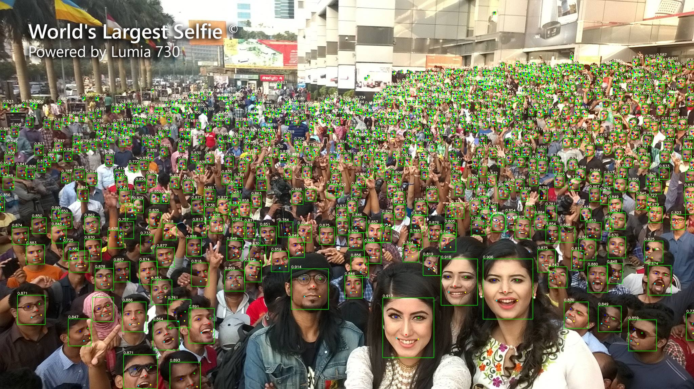
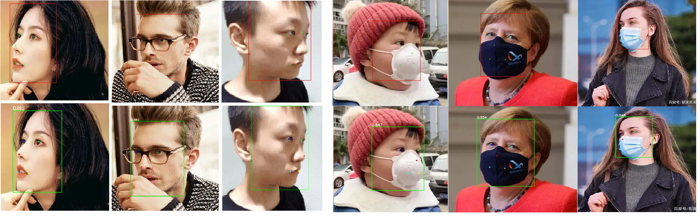

## yolov5-face-occlusion-project
- 연구 목표: YOLOv5 기반 얼굴검출 신경망을 사용하여, occlusion으로 얼굴 검출이 어려운 상황에서도 검출률을 올리는 방법을 연구한다.
- occlusion: 사람의 손이 가렸을 때를 가정, 1가지 손 사진을 이용하여 의도적으로 얼굴부분을 가린다.
             얼굴과 손의 bounding box를 occlusion 정도로 정하여 가려지는 정도를 판단한다.
- dataset: widerface dataset 중 1사람만 있는 데이터 사용(label에 1명만 인식된 경우)
- 가장 mAP비율이 낮은 것을 train image에 50% 포함하여 재학습

## Introduction

Yolov5-face is a real-time,high accuracy face detection.


## Performance

Single Scale Inference on VGA resolution（max side is equal to 640 and scale).

***Large family***

| Method              | Backbone       | Easy  | Medium | Hard  | \#Params(M) | \#Flops(G) |
| :------------------ | -------------- | ----- | ------ | ----- | ----------- | ---------- |
| DSFD (CVPR19)       | ResNet152      | 94.29 | 91.47  | 71.39 | 120.06      | 259.55     |
| RetinaFace (CVPR20) | ResNet50       | 94.92 | 91.90  | 64.17 | 29.50       | 37.59      |
| HAMBox (CVPR20)     | ResNet50       | 95.27 | 93.76  | 76.75 | 30.24       | 43.28      |
| TinaFace (Arxiv20)  | ResNet50       | 95.61 | 94.25  | 81.43 | 37.98       | 172.95     |
| SCRFD-34GF(Arxiv21) | Bottleneck Res | 96.06 | 94.92  | 85.29 | 9.80        | 34.13      |
| SCRFD-10GF(Arxiv21) | Basic Res      | 95.16 | 93.87  | 83.05 | 3.86        | 9.98       |
| -                   | -              | -     | -      | -     | -           | -          |
| ***YOLOv5s***       | CSPNet         | 94.67 | 92.75  | 83.03 | 7.075       | 5.751      |
| **YOLOv5s6**        | CSPNet         | 95.48 | 93.66  | 82.8  | 12.386      | 6.280      |
| ***YOLOv5m***       | CSPNet         | 95.30 | 93.76  | 85.28 | 21.063      | 18.146     |
| **YOLOv5m6**        | CSPNet         | 95.66 | 94.1   | 85.2  | 35.485      | 19.773     |
| ***YOLOv5l***       | CSPNet         | 95.78 | 94.30  | 86.13 | 46.627      | 41.607     |
| ***YOLOv5l6***      | CSPNet         | 96.38 | 94.90  | 85.88 | 76.674      | 45.279     |


***Small family***

| Method               | Backbone        | Easy  | Medium | Hard  | \#Params(M) | \#Flops(G) |
| -------------------- | --------------- | ----- | ------ | ----- | ----------- | ---------- |
| RetinaFace (CVPR20   | MobileNet0.25   | 87.78 | 81.16  | 47.32 | 0.44        | 0.802      |
| FaceBoxes (IJCB17)   |                 | 76.17 | 57.17  | 24.18 | 1.01        | 0.275      |
| SCRFD-0.5GF(Arxiv21) | Depth-wise Conv | 90.57 | 88.12  | 68.51 | 0.57        | 0.508      |
| SCRFD-2.5GF(Arxiv21) | Basic Res       | 93.78 | 92.16  | 77.87 | 0.67        | 2.53       |
| -                    | -               | -     | -      | -     | -           | -          |
| ***YOLOv5n***        | ShuffleNetv2    | 93.74 | 91.54  | 80.32 | 1.726       | 2.111      |
| ***YOLOv5n-0.5***    | ShuffleNetv2    | 90.76 | 88.12  | 73.82 | 0.447       | 0.571      |


## Pretrained-Models

| Name        | Easy  | Medium | Hard  | FLOPs(G) | Params(M) | Link                                                         |
| ----------- | ----- | ------ | ----- | -------- | --------- | ------------------------------------------------------------ |
| yolov5n-0.5 | 90.76 | 88.12  | 73.82 | 0.571    | 0.447     | Link: https://pan.baidu.com/s/1UgiKwzFq5NXI2y-Zui1kiA  pwd: s5ow, https://drive.google.com/file/d/1XJ8w55Y9Po7Y5WP4X1Kg1a77ok2tL_KY/view?usp=sharing |
| yolov5n     | 93.61 | 91.52  | 80.53 | 2.111    | 1.726     | Link: https://pan.baidu.com/s/1xsYns6cyB84aPDgXB7sNDQ  pwd: lw9j,https://drive.google.com/file/d/18oenL6tjFkdR1f5IgpYeQfDFqU4w3jEr/view?usp=sharing |
| yolov5s     | 94.33 | 92.61  | 83.15 | 5.751    | 7.075     | Link: https://pan.baidu.com/s/1fyzLxZYx7Ja1_PCIWRhxbw  Link: eq0q,https://drive.google.com/file/d/1zxaHeLDyID9YU4-hqK7KNepXIwbTkRIO/view?usp=sharing |
| yolov5m     | 95.30 | 93.76  | 85.28 | 18.146   | 21.063    | Link: https://pan.baidu.com/s/1oePvd2K6R4-gT0g7EERmdQ  pwd: jmtk, https://drive.google.com/file/d/1Sx-KEGXSxvPMS35JhzQKeRBiqC98VDDI |
| yolov5l     | 95.78 | 94.30  | 86.13 | 41.607   | 46.627    | Link: https://pan.baidu.com/s/11l4qSEgA2-c7e8lpRt8iFw  pwd: 0mq7, https://drive.google.com/file/d/16F-3AjdQBn9p3nMhStUxfDNAE_1bOF_r |

## Data preparation

1. Download WIDERFace datasets.
2. Download annotation files from [google drive](https://drive.google.com/file/d/1tU_IjyOwGQfGNUvZGwWWM4SwxKp2PUQ8/view?usp=sharing).

```shell
cd data
python3 train2yolo.py /path/to/original/widerface/train [/path/to/save/widerface/train]
python3 val2yolo.py  /path/to/original/widerface [/path/to/save/widerface/val]
```


## Training

```shell
CUDA_VISIBLE_DEVICES="0,1,2,3" python3 train.py --data data/widerface.yaml --cfg models/yolov5s.yaml --weights 'pretrained models'
```


## WIDERFace Evaluation

```shell
python3 test_widerface.py --weights 'your test model' --img-size 640

cd widerface_evaluate
python3 evaluation.py
```

#### Test



#### Landmark Visulization 


First row: RetinaFace, 2nd row: YOLOv5m-Face 
**YOLO5Face was used in the 3rd place standard face recogntion track of the [ICCV2021 Masked Face Recognition Challenge](https://www.face-benchmark.org/challenge.html).** 

#### References

https://github.com/ultralytics/yolov5

https://github.com/DayBreak-u/yolo-face-with-landmark

https://github.com/xialuxi/yolov5_face_landmark

https://github.com/biubug6/Pytorch_Retinaface

https://github.com/deepinsight/insightface

